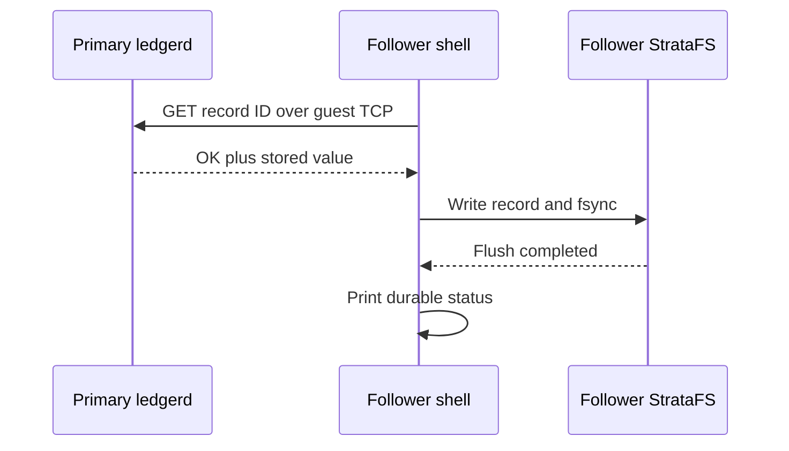

# Pulling a durable ledger record

```mermaid
sequenceDiagram
    participant A as Primary ledgerd
    participant B as Follower shell
    participant D as Follower StrataFS
    B->>A: GET record ID over guest TCP
    A-->>B: OK plus stored value
    B->>D: Write record and fsync
    D-->>B: Flush completed
    B->>B: Print durable status
```

The [two-guest test](../../scripts/test_replication.py) captures the Ethernet
exchange and reboots the follower with the same disk.
