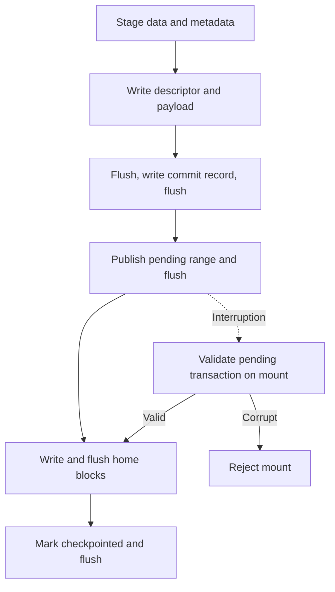

# StrataFS write-ahead logging

```mermaid
flowchart TD
    A[Stage data and metadata] --> B[Write descriptor and payload]
    B --> C[Flush, write commit record, flush]
    C --> D[Publish pending range and flush]
    D --> E[Write and flush home blocks]
    E --> F[Mark checkpointed and flush]
    D -. Interruption .-> G[Validate pending transaction on mount]
    G -->|Valid| E
    G -->|Corrupt| H[Reject mount]
```

See the [on-disk format](../spec/storage-format.md).
